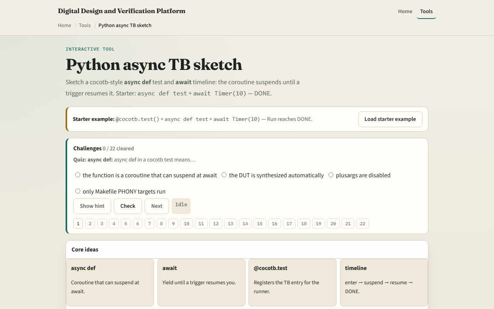

# Python async TB

Cocotb tests are Python coroutines

---

## async, await, and the decorator
- Three pieces fit together
- Async def declares a coroutine, the function can pause at await and come back later
- Await hands control to the event loop until a trigger fires
- The cocotb test decorator registers your coroutine so the runner actually starts it
- A plain def test cannot await

---

## Browser lab

---

## Real cocotb track practice
- In the real cocotb track, open this module's examples prompts
- Restate the async testbench idea in one sentence, coroutine plus await plus registration
- Sketch a tiny async test on paper
- Optional stretch
- No simulator required yet; the goal is to recognize the shape when you see it in code

---

## Pitfalls to watch
- Do not use a plain def when you need await
- Do not forget the test decorator
- Do not assume await is instant
- And remember

---

## Your turn
- Complete the checklist for at least one track, preferably both
- In the browser, load starter, run to DONE
- On paper, write one valid cocotb test skeleton with all three pieces named
- When you are ready, take the short quiz, then continue to cocotb triggers

