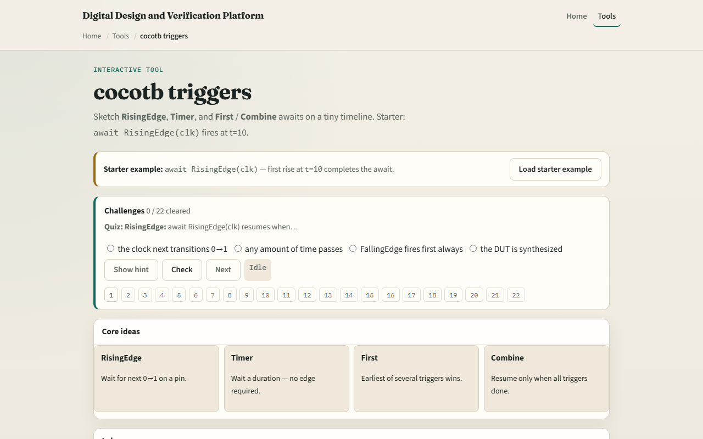

# cocotb triggers

Every await in a cocotb test waits on a trigger, an object that tells the simulator when to resume your coroutine

---

## Edge, timer, and compose triggers
- RisingEdge on a clock resumes on the next zero-to-one transition
- Timer ignores pins and completes after N time units
- First is a race: whichever trigger finishes first wins and the others are cancelled
- Combine is a join
- Pick the trigger that matches the event you actually care about

---

## Browser lab

---

## Real cocotb track practice
- In the real cocotb track, open this module's examples prompts
- Restate what a trigger does in one sentence
- Sketch one await chain on paper
- Optional stretch
- Again, no live simulator required here

---

## Pitfalls to watch
- Do not await RisingEdge when you meant FallingEdge
- Do not treat Timer like a wall-clock sleep
- First cancels losing triggers; Combine waits for all, swapping them changes test semantics
- If no edge ever arrives
- The browser timeline is simplified

---

## Your turn
- Complete the checklist for at least one track, preferably both
- In the browser, run starter RisingEdge at ten, load a First preset where the timer wins
- On paper, draw a tiny timeline with one rise, one fall
- When you are ready, take the short quiz, then continue to the cocotb clock helper

