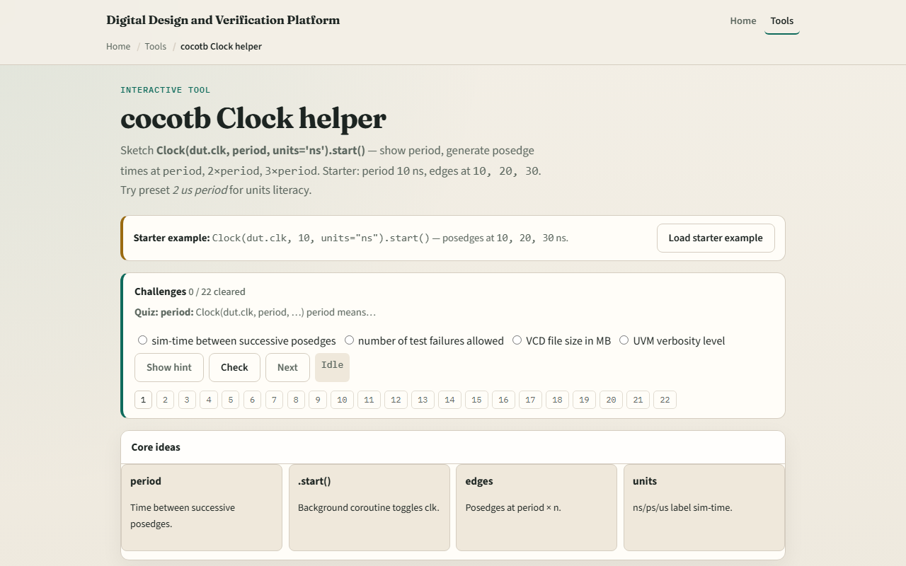

# cocotb Clock helper

After triggers, you need a clock that runs while your test does other work

---

## Period, start, and edge times
- The period is the full cycle length, low half, then high half
- With period ten and units nanoseconds
- Start runs alongside your async test; it does not block the rest of the coroutine
- Pair this with RisingEdge from the last module and you have a clean rhythm

---

## Browser lab

---

## Real cocotb practice
- In the real cocotb track, sketch the helper on paper before you run a simulator
- Write Clock with dut dot clk, period ten, units ns, then start on its own line
- List the first three posedge times you expect
- Optional: open the lab’s source sketch panel and read the comment block
- This module is clock-generation literacy, not a full UART testbench yet

---

## Pitfalls to watch
- Do not confuse the Clock helper with manually flipping dut dot clk dot value every step
- A common miss is mixing up period with half-period
- Watch units too, ten nanoseconds and ten microseconds are not the same timeline
- And remember

---

## Your turn
- Complete the checklist for at least one track, preferably both
- In the browser, load the starter and predict the third posedge before you reveal it
- On paper, write the Clock line and three edge times for period eight
- When you are ready

