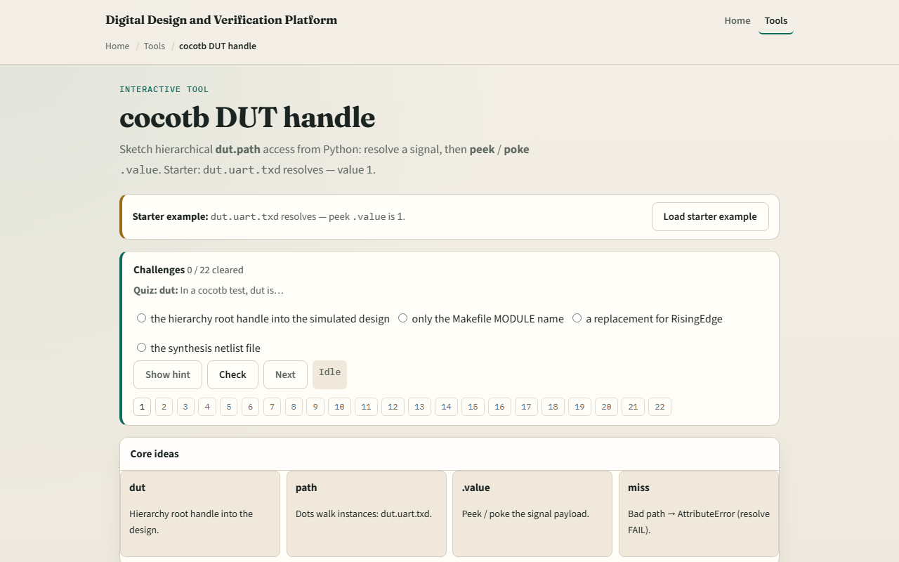

# cocotb DUT handle

Triggers tell you when to act

---

## Path walk and dot value
- Dut is the hierarchy root the simulator hands your test
- Attribute dots walk instances
- Reading dot value peeks; assigning dot value pokes
- A missing name raises AttributeError, there is no silent None for a bad path
- Deeper nests like dut dot core dot regs dot r zero are the same idea

---

## Browser lab

---

## Real cocotb practice
- In the real cocotb track, restate the handle idea on paper before you touch a simulator
- Draw a tiny hierarchy: top, uart block, txd leaf
- Write one peek line and one poke line using dot value
- A ghost path that fails
- This module is handle literacy, not a full live UART simulation yet

---

## Pitfalls to watch
- Watch for inventing hierarchy names that are not in the netlist
- A common trap is forgetting dot value; the handle is not the bit by itself
- Another miss is treating a successful resolve as correct stimulus
- The browser tree is literacy

---

## Your turn
- Complete the checklist for at least one track, preferably both
- In the browser, load the starter and try one missing-path challenge
- Explain path walk and dot value in your own words, then sketch one poke and one peek
- When you are ready

