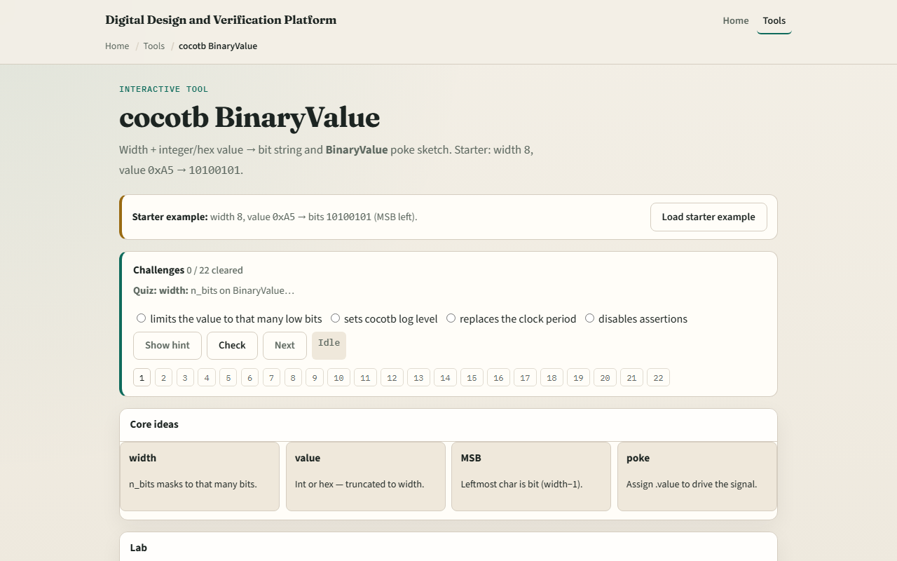

# cocotb BinaryValue

Plain Python integers do not carry bit width

---

## Width, value, and bit string
- N bits sets how many bits are kept, wider input is truncated to the low bits
- Starter example
- Decimal two fifty-five and hex F F mean the same eight-bit pattern
- Dut dot data dot value equals BinaryValue with your literal and n bits equals width
- To read back, convert the signal value to int when you need a Python number

---

## Browser lab

---

## Real cocotb practice
- In the real cocotb track, work the bit math on paper before you drive a live signal
- Write BinaryValue for hex A five with n bits eight and draw the MSB-left string bit by bit
- Try width four with hex F and confirm all ones
- Optional: open the lab’s source sketch and read how poke and int peek are commented
- This module is width-aware drive literacy, not a full scoreboard yet

---

## Pitfalls to watch
- Do not assume Python’s bin of an integer matches cocotb’s MSB-left string without applying
- A common miss is reading bits MSB-right, cocotb prints index width minus one on the left
- Another trap is poking a wider value than the port
- And remember

---

## Your turn
- Complete the checklist for at least one track, preferably both
- In the browser, load the starter and predict the bit string before you set value
- On paper, convert hex A five to eight bits MSB left without looking
- When you are ready

