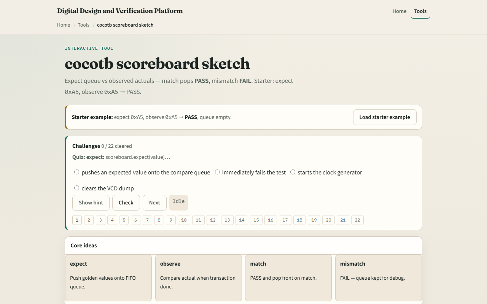

# Module 06 — cocotb scoreboard

**Module id:** module06-cocotb-scoreboard
**Lab:** cocotb-scoreboard
**Tracks:** A (concept / offline) · B (browser lab)

## Slide 1 — cocotb scoreboard

A scoreboard checks that what the DUT actually did matches what you expected—transaction by transaction. In cocotb you push golden values onto an expect queue before the response arrives. When a transaction completes, you observe the actual value and compare it to the front of the queue. Match means pass and pop; mismatch means fail and leave the queue for debug.

## Slide 2 — Expect queue and observe

Order matters—the queue is a FIFO. Push expect hex A five before the DUT responds, then observe A five when data is valid. One match empties the queue. Push two expects in order and observe both in order for two passes. Observe the wrong byte and you fail without popping. Observe when the queue is empty and you fail too—there was nothing left to check against.

## Slide 3 — Browser lab

In the browser lab track, open the cocotb scoreboard sketch. You will see a challenge panel, an expect queue, and observe controls with a verdict readout. Load the starter—push expect A five, observe A five, pass, queue empty—then try the mismatch preset so you see fail with the queue unchanged. Work a few challenges and use Check when ready. Orient here; do not tour every button.

## Slide 4 — Real cocotb practice

In the real cocotb track, restate the scoreboard loop on paper before you wire a live component. Draw a three-step timeline: push expect, DUT responds, compare and pop or fail. Write pseudocode for expect push and compare on one byte. Optional: open the lab’s source sketch and read how match and mismatch are commented. This module is expect-versus-observe literacy—not a full pyuvm scoreboard yet.

## Slide 5 — Pitfalls to watch

Do not compare before the transaction is complete—observe at the wrong cycle looks like a mismatch. Do not pop the queue on failure; you need the expected value left for debug. A common miss is pushing expects out of order when the DUT returns in order. And remember: the browser queue is literacy; real fidelity is a scoreboard hooked to your monitor’s actual stream.

## Slide 6 — Your turn

Complete the checklist for at least one track—preferably both. In the browser, load the starter and predict pass before you observe. On paper, sketch push, observe, and pop for two expects in sequence. When you are ready, take the short quiz, then continue to cocotb versus UVM roles in the next module.
