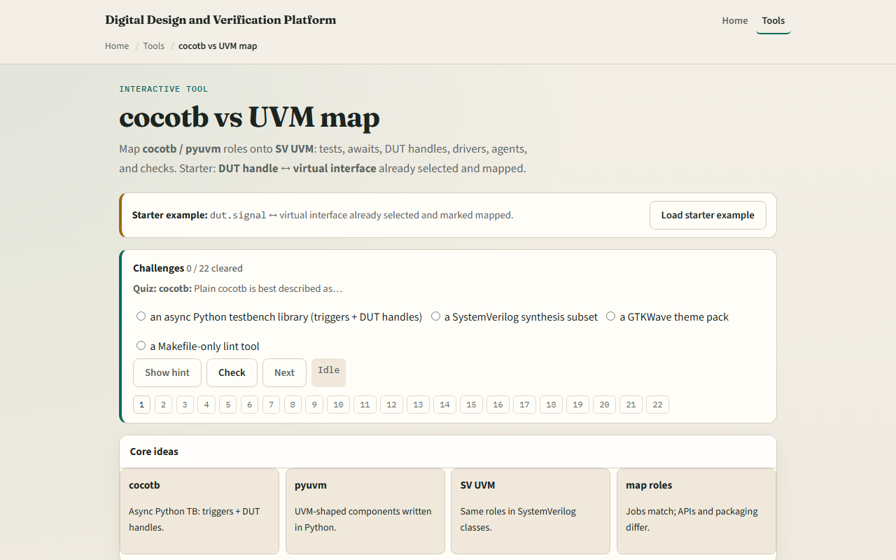

# cocotb ↔ UVM roles

Plain cocotb is Python driving a simulator with async triggers and DUT handles

---

## Six role pairs
- Six pairs bridge the worlds
- Cocotb test decorator and Makefile module versus UVM test plus test name plusarg
- Time: await RisingEdge or Timer versus posedge and delay
- DUT access: dut handle versus virtual interface
- Drive: Python pin assigns versus driver through vif
- Structure: pyuvm agent versus uvm agent

---

## Browser lab

---

## Real cocotb practice
- In the real cocotb track, restate the map on paper before you open a Makefile or UVM tree
- Pick three pairs, test, await
- Optional: open the lab’s source sketch and read the comment header
- This module is role literacy, not choosing pyuvm versus plain cocotb for your project yet

---

## Pitfalls to watch
- Do not treat the map as one-to-one syntax, APIs differ even when roles match
- A common miss is assuming pyuvm is required for every cocotb bench
- Another trap is mapping driver to raw Python assigns when you already built a pyuvm agent
- And remember

---

## Your turn
- Complete the checklist for at least one track, preferably both
- In the browser, load the starter and name what dut maps to on the UVM side
- On paper, fill in test and await for both columns without looking
- When you are ready

