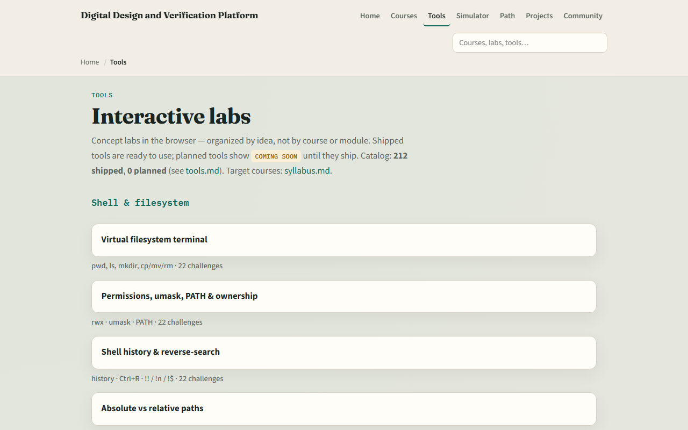

# cocotb path complete

Mapping cocotb onto UVM roles, then self-check patterns, wave literacy, and one offline cocotb run

---

## What you can do now
- You can sketch a Python async testbench and explain how awaits and triggers pace
- Map cocotb pieces onto SystemVerilog UVM roles in your own words
- You have run, or rehearsed, at least one real offline example with a simulator
- That literacy is what pyuvm methodology and later protocol work expect

---

## Close the track gaps
- If you mainly waited on browser labs, finish module ten offline, venv, make
- Waveform reading
- Either track works for self-study; both together stick best before you move on
- Remember: browser tools are literacy sketches, not a substitute for a live cocotb run

---

## The tools you practiced
- Here is the tools index again, the same shelf of Python async, cocotb
- You do not need to re-clear every challenge
- Use it as a map

---

## Next
- Complete the quiz for this part
- Multi-agent ideas, building on the cocotb habits you just finished

---

## Your turn
- Review the wrap checklist in the module README
- Can say how cocotb fits before pyuvm methodology
- When you are ready, take the short quiz, then open learn pyuvm on the syllabus

